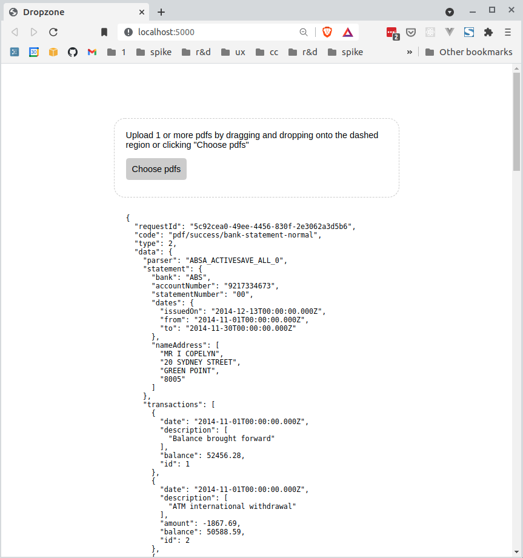

# Sample Web

Sample app demonstrating how to access Spike API. See full [docs](https://app.spikedata.co.za/docs/code/) online.

This sample demonstrates how to use the Spike API in your own web application.

**NOTE**:

- all calls to Spike are authenticated using tokens
- in order to protect your token you must **NOT** make direct calls to Spike from the frontend
- instead you should proxy the call via a web server - i.e. frontend -> server -> spike
  - see:
  - frontend [proxy.ts](./src/ux/proxy.ts)
  - server [/pdf](./src/server/pdf/index.js)

## Register

- First register for an account on [spike](https://app.spikedata.co.za/)
- Get your apikey and userkey from the settings page - you'll use them below

## How to run

run the proxy server locally

```sh
# get sample repo
git clone https://github.com/spikedata/samples
cd samples
yarn install

# configure sample
cd samples/sample-web
code ./src/server/config.js # edit config.js and enter your token

# build & run
yarn build
yarn start
```

now browse the site:

- http://localhost:5000/
- and upload a pdf

## Screenshot


