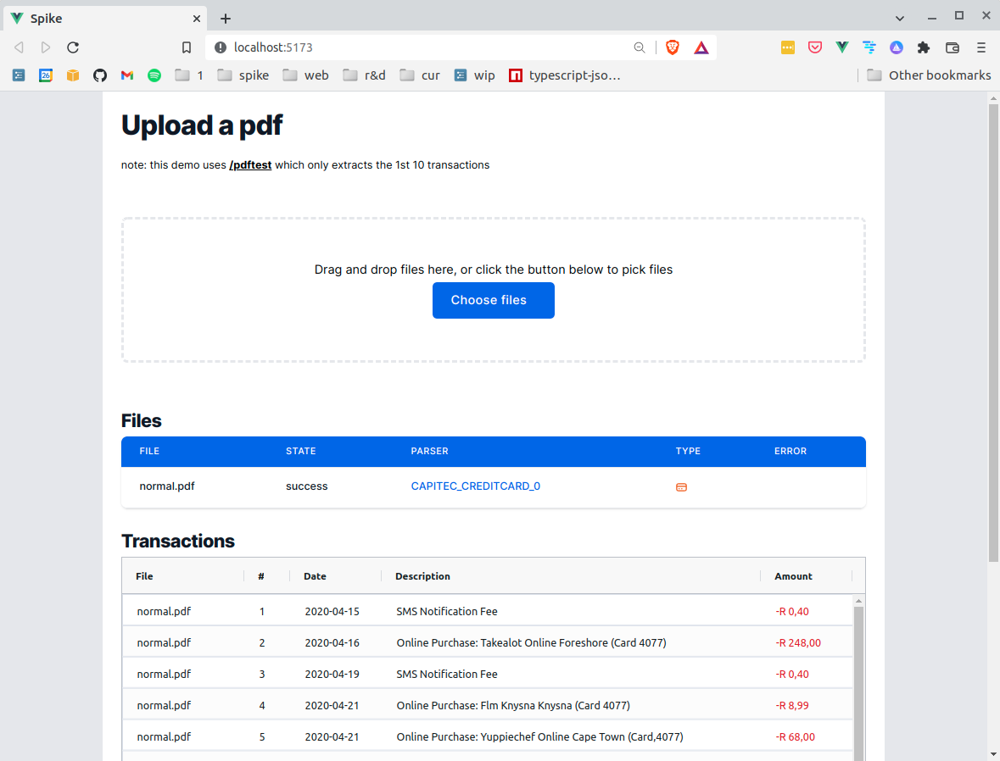
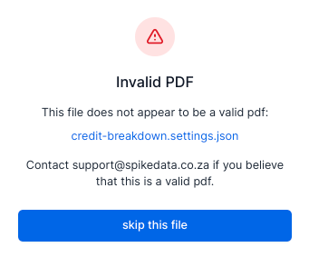
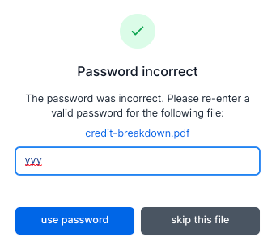

# Sample Web

Sample app demonstrating how to access Spike API. See full [docs](https://app.spikedata.co.za/docs/code/) online.

This sample demonstrates how to use the Spike API in your own web application.

**NOTE**:

- all calls to Spike are authenticated using tokens
- in order to protect your token you must **NOT** make direct calls to Spike from the frontend
- instead you should proxy the call via a web server - i.e. frontend -> server -> spike
  - see:
  - frontend [proxy.ts](./src/ux/proxy.ts)
  - server [/pdf](./src/server/pdf/index.js)

## 1. Register

- First register for an account on [spike](https://app.spikedata.co.za/)
- Get your apikey and userkey from the settings page - you'll use them below

## 2. How to run

run the proxy server locally

```sh
# get sample repo
git clone https://github.com/spikedata/samples
cd samples
yarn install

# configure sample
cd samples/sample-web
code ./src/config.js # edit config.js and enter your TOKEN. Also pick REQUEST_TYPE.

# run dev server
yarn dev
```

now browse the site:

- http://localhost:5000/
- and upload a pdf

## 3. Screenshot



## 4. UX advice

### 4.1 file upload

- handle non-pdf files
  - file open dialog is limited to \*.pdf, but can drag-n-drop any files
  - 
- handle password protected pdfs
  - try read the file to see wether it is password protected
  - allow user to enter a password
  - 
  - check this password is correct and re-ask if not
  - allow user to skip file (e.g. if they don't know the password and want to carry on trying the next pdfs)
  - 
- allow multiple pdfs
  - try previous passwords so user doesn't have to re-enter same password multiple times
    - see [tryNoPasswordOrPreviousPasswords()](./src/views/Upload.vue)

### 4.2 handling all possible responses

- there are a variety of error conditions which stem locally (rather than from the Spike API)
  - pdf too large (our api can only handle max 5MB pdfs)
  - network is down or slow (timeout)
- make sure that you remember to handle these conditions as well as all the possible Spike API responses
  - you can see examples of all Spike response in the docs as well as the [@spike/api-statements/examples/gen/v2common.js](../../node_modules/@spike/api-statements/build/module/examples/gen/v2common.js)
